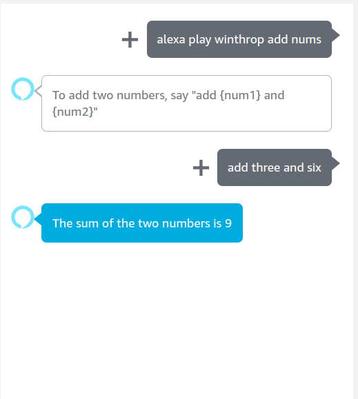

# Alexa "Add Nums" Skill
This Alexa skill will accept two numbers from the user and add them, outputting the sum with Alexa audio.
# Instructions for use
Alexa, play winthrop add nums\
add {first number} and {second number}\

# Credits
#### Parker Hendry
#### hendryp2@winthrop.edu

