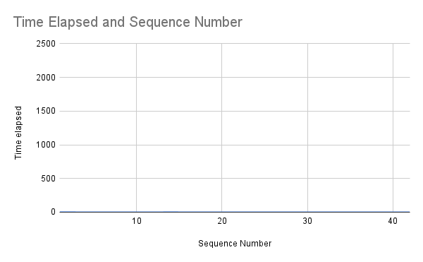
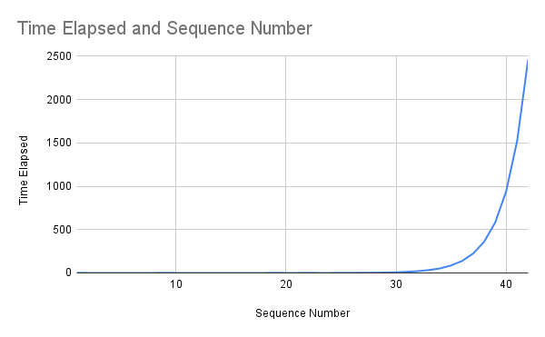

# Closure Timer
This Javascript app will print each fibonacci number up to the number given by the user. Two methods are available for computing the fibonacci numbers: recursion and iteration. The method is chosen by the switch entered by the user. Both methods are timed, which can be used for empirical analysis. The two analysis files show the time difference of the two methods. 
# Instructions for use
node fibonacci.js [OPTION] [NUMBER]
# Options
-h, --help\
	Output a usage message and exit.\
-r, --recursive\
	Use recursive method when computing and timing fibonacci numbers\
-i, --iterative\
	Use iterative method when computing and timing fibonacci numbers\
# Results
Iterative:\
\
Recursive:\

# Credits
#### Parker Hendry
#### hendryp2@winthrop.edu
